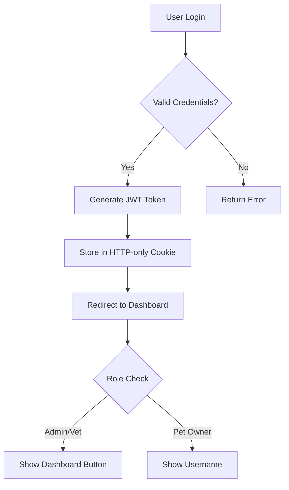

# 🐾 VetCare Assistant

<div align="center">

[](https://nextjs.org/)
[](https://www.typescriptlang.org/)
[](https://www.mongodb.com/atlas)
[](https://tailwindcss.com/)
[](https://opensource.org/licenses/MIT)

**An advanced AI-powered veterinary consultation platform providing real-time veterinary information, role-based access control, and comprehensive pet care services.**

[🚀 Live Demo](#) • [📖 Documentation](#) • [🐛 Report Bug](#) • [✨ Request Feature](#)

</div>

---

## 📚 Table of Contents

- [✨ Features](#-features)
- [🎯 New Features & Enhancements](#-new-features--enhancements)
- [🛠 Tech Stack](#-tech-stack)
- [🚀 Quick Start](#-quick-start)
- [🏗 Architecture](#-architecture)
- [🔐 Authentication & Authorization](#-authentication--authorization)
- [🤖 AI Integration](#-ai-integration)
- [📱 User Interface](#-user-interface)
- [🔧 Environment Setup](#-environment-setup)
- [📊 API Documentation](#-api-documentation)
- [🧪 Testing](#-testing)
- [🚀 Deployment](#-deployment)
- [🤝 Contributing](#-contributing)
- [📄 License](#-license)

---

## ✨ Features

### 🤖 AI-Powered Veterinary Assistant
- **Real-time Veterinary Information**: Integrated with Groq and Tavily for up-to-date veterinary knowledge
- **Smart Query Processing**: Automatically detects and handles current (2025) information requests
- **Conversation History**: Maintains context-aware chat history per user
- **Domain-Specific Responses**: Focused on veterinary and animal health topics
- **Multi-language Support**: Support for multiple languages in AI responses

### 🔐 Advanced Authentication & Authorization
- **Role-Based Access Control (RBAC)**: Admin, Veterinarian, and Pet Owner roles
- **Secure JWT Authentication**: HTTP-only cookies for enhanced security
- **Password Reset**: Email-based password recovery system
- **Session Management**: Secure MongoDB-based session handling
- **Multi-tenant Support**: Tenant-based user isolation

### 💻 Modern User Interface
- **Responsive Design**: Mobile-first approach with desktop optimization
- **Role-Based Navigation**: Dynamic navbar based on user roles
- **Interactive Components**: Built with shadcn/ui components
- **Real-time Chat Interface**: Smooth, responsive chat experience
- **Accessibility**: WCAG 2.1 compliant design

### 📊 User Management
- **User Profiles**: Comprehensive user profile management
- **Contact Management**: Track user interactions and inquiries
- **Activity Logging**: Detailed user activity tracking
- **Data Analytics**: User engagement and usage analytics

---

## 🎯 New Features & Enhancements

### 🔄 Role-Based Dashboard Access
- **Admin Dashboard**: Full system administration and user management
- **Veterinarian Dashboard**: Professional tools and patient management
- **Pet Owner Interface**: Personalized pet care information and services
- **Dynamic Navigation**: Context-aware menu items based on user role

### 📧 Enhanced Communication
- **Email Integration**: NodeMailer for automated email notifications
- **Contact Form**: Advanced contact form with validation
- **FAQ System**: Comprehensive frequently asked questions
- **Support Tickets**: Integrated support system for user assistance

### 🏥 Veterinary Services
- **Service Catalog**: Detailed veterinary services and pricing
- **Appointment Scheduling**: Online booking system (coming soon)
- **Health Records**: Digital pet health records (coming soon)
- **Emergency Services**: 24/7 emergency contact information

### 🔒 Security Enhancements
- **Input Validation**: Comprehensive input sanitization
- **Rate Limiting**: API rate limiting for security
- **CORS Protection**: Cross-origin resource sharing security
- **Data Encryption**: End-to-end data encryption
- **Audit Logging**: Comprehensive security audit trails

### 📱 Mobile Optimization
- **Progressive Web App**: PWA capabilities for mobile users
- **Offline Support**: Basic offline functionality
- **Push Notifications**: Real-time notifications (coming soon)
- **Mobile-First Design**: Optimized for mobile devices

---

## 🛠 Tech Stack

### Frontend
- **Framework**: Next.js 14 (App Router)
- **Language**: TypeScript 5.0
- **Styling**: Tailwind CSS 3.0
- **Components**: shadcn/ui
- **State Management**: React Context + useState
- **Animations**: Framer Motion
- **Icons**: Lucide React

### Backend
- **Runtime**: Node.js 18+
- **API**: Next.js API Routes
- **Database**: MongoDB Atlas
- **Authentication**: JWT + bcrypt
- **Caching**: Node-Cache
- **Email**: NodeMailer

### AI & Search
- **LLM**: Groq (llama-3.1-8b-instant)
- **Web Search**: Tavily API
- **Response Format**: Markdown with structured data
- **Context Management**: Conversation history

### Development Tools
- **Linting**: ESLint
- **Formatting**: Prettier
- **Type Checking**: TypeScript
- **Version Control**: Git
- **Package Manager**: npm/yarn

---

## 🚀 Quick Start

### Prerequisites
- Node.js 18.0 or later
- MongoDB Atlas account
- Groq API key
- Tavily API key
- Email service (Gmail/SendGrid)

### Installation

1. **Clone the repository**:
```bash
git clone https://github.com/jhaalok1997/vetCare.git
cd vetCare
```

2. **Install dependencies**:
```bash
npm install
# or
yarn install
```

3. **Set up environment variables**:
```env
# Database
MONGODB_URI=your_mongodb_connection_string

# Authentication
JWT_SECRET=your_jwt_secret

# AI Services
GROQ_API_KEY=your_groq_api_key
TAVILY_API_KEY=your_tavily_api_key
ENABLE_TAVILY=true

# Email Service
EMAIL_HOST=smtp.gmail.com
EMAIL_PORT=587
EMAIL_USER=your_email@gmail.com
EMAIL_PASS=your_app_password

# Application
NEXT_PUBLIC_APP_URL=http://localhost:3000
```

4. **Run the development server**:
```bash
npm run dev
# or
yarn dev
```

5. **Open your browser**:
Navigate to [http://localhost:3000](http://localhost:3000)

---

## 🏗 Architecture

### System Architecture
```
┌─────────────────┐    ┌─────────────────┐    ┌─────────────────┐
│   Frontend      │    │   Backend       │    │   External      │
│   (Next.js)     │◄──►│   (API Routes)  │◄──►│   Services      │
│                 │    │                 │    │                 │
│ • React         │    │ • JWT Auth      │    │ • Groq AI       │
│ • TypeScript    │    │ • MongoDB       │    │ • Tavily Search │
│ • Tailwind CSS  │    │ • NodeMailer    │    │ • Email Service │
│ • shadcn/ui     │    │ • Validation    │    │                 │
└─────────────────┘    └─────────────────┘    └─────────────────┘
```

### Database Schema
```typescript
// User Model
interface User {
  _id: ObjectId;
  username: string;
  email: string;
  password: string;
  role: 'petOwner' | 'vet' | 'admin';
  tenantId: string;
  resetToken?: string;
  resetTokenExpiry?: Date;
  createdAt: Date;
  updatedAt: Date;
}

// ContactedUser Model
interface ContactedUser {
  _id: ObjectId;
  name: string;
  email: string;
  message: string;
  phone?: string;
  createdAt: Date;
}
```

### API Routes Structure
```
/api/
├── Auth/
│   ├── login/route.ts
│   ├── signup/route.ts
│   ├── logout/route.ts
│   ├── profile/route.ts
│   ├── forgot-password/route.ts
│   └── reset-password/route.ts
├── AskVetcare-button/route.ts
├── ContactedUser/route.ts
└── faqs/route.ts
```

---

## 🔐 Authentication & Authorization

### User Roles
- **Pet Owner**: Basic access to services and AI assistant
- **Veterinarian**: Professional tools and dashboard access
- **Admin**: Full system administration and user management

### Authentication Flow


### Security Features
- **Password Hashing**: bcrypt with salt rounds
- **JWT Tokens**: Secure token-based authentication
- **HTTP-only Cookies**: Prevents XSS attacks
- **Input Validation**: Comprehensive input sanitization
- **Rate Limiting**: API endpoint protection
- **CORS Protection**: Cross-origin security

---

## 🤖 AI Integration

### Groq Integration
```typescript
const model = new ChatGroq({
  apiKey: process.env.GROQ_API_KEY,
  model: "llama-3.1-8b-instant",
  temperature: 0.3,
  maxTokens: 1000
});
```

### Tavily Search Integration
```typescript
const tavilyClient = tavily({ 
  apiKey: process.env.TAVILY_API_KEY 
});

const searchOptions = {
  search_depth: "advanced",
  include_domains: [
    "avma.org",
    "vin.com", 
    "merckvetmanual.com",
    "vetmed.illinois.edu"
  ]
};
```

### AI Processing Pipeline
1. **Query Validation**: Check if query is veterinary-related
2. **Current Information Detection**: Identify if query needs recent data
3. **Tavily Search**: Search for recent veterinary information
4. **Groq Processing**: Generate AI response using LLM
5. **Response Formatting**: Format response with markdown
6. **History Management**: Store conversation history

---

## 📱 User Interface

### Component Library
- **shadcn/ui**: Modern, accessible components
- **Custom Components**: Specialized veterinary components
- **Responsive Design**: Mobile-first approach
- **Dark Mode**: Theme switching capability

### Key Components
- **Navbar**: Role-based navigation with user info
- **AuthWrapper**: Authentication state management
- **VetAssistant**: AI chat interface
- **ServiceCards**: Service display components
- **ContactForm**: User inquiry form

### Design System
- **Color Palette**: Veterinary-themed color scheme
- **Typography**: Clear, readable fonts
- **Spacing**: Consistent spacing system
- **Icons**: Lucide React icon library

---

## 🔧 Environment Setup

### Required Environment Variables

| Variable | Description | Required | Default |
|----------|-------------|----------|---------|
| `MONGODB_URI` | MongoDB connection string | ✅ | - |
| `JWT_SECRET` | Secret for JWT tokens | ✅ | - |
| `GROQ_API_KEY` | Groq API key | ✅ | - |
| `TAVILY_API_KEY` | Tavily API key | ✅ | - |
| `ENABLE_TAVILY` | Enable Tavily integration | ✅ | `true` |
| `EMAIL_HOST` | SMTP host for emails | ✅ | - |
| `EMAIL_PORT` | SMTP port | ✅ | `587` |
| `EMAIL_USER` | Email username | ✅ | - |
| `EMAIL_PASS` | Email password | ✅ | - |
| `NEXT_PUBLIC_APP_URL` | Application URL | ❌ | `http://localhost:3000` |

### Development Setup
```bash
# Install dependencies
npm install

# Set up environment variables
cp .env.example .env.local

# Run development server
npm run dev

# Run linting
npm run lint

# Run type checking
npm run type-check
```

---

## 📊 API Documentation

### Authentication Endpoints

#### POST `/api/Auth/signup`
Register a new user account.

**Request Body:**
```json
{
  "username": "string",
  "email": "string",
  "password": "string",
  "role": "petOwner" | "vet" | "admin"
}
```

**Response:**
```json
{
  "success": true,
  "message": "User created successfully",
  "user": {
    "id": "string",
    "username": "string",
    "email": "string",
    "role": "string"
  }
}
```

#### POST `/api/Auth/login`
Authenticate user and return JWT token.

**Request Body:**
```json
{
  "email": "string",
  "password": "string"
}
```

**Response:**
```json
{
  "success": true,
  "message": "Login successful",
  "user": {
    "id": "string",
    "username": "string",
    "email": "string",
    "role": "string"
  }
}
```

### AI Assistant Endpoint

#### POST `/api/AskVetcare-button`
Get AI-powered veterinary assistance.

**Request Body:**
```json
{
  "query": "string",
  "conversationHistory": "array"
}
```

**Response:**
```json
{
  "response": "string",
  "sources": "array",
  "timestamp": "string"
}
```

---

## 📄 License

This project is licensed under the MIT License - see the [LICENSE](LICENSE) file for details.

---

## 👥 Authors

- **Alok Kumar Jha** - *Initial work & Lead Developer* - [@jhaalok1997](https://github.com/jhaalok1997)

---

## 🙏 Acknowledgments

- [shadcn/ui](https://ui.shadcn.com/) for the beautiful component library
- [Next.js](https://nextjs.org/) team for the amazing framework
- [MongoDB](https://www.mongodb.com/) team for the reliable database
- [Groq](https://groq.com/) for the AI processing capabilities
- [Tavily](https://tavily.com/) for the search functionality
- All contributors and supporters

---

## 📞 Support

- **Documentation**: [Wiki](https://github.com/jhaalok1997/vetCare/wiki)
- **Issues**: [GitHub Issues](https://github.com/jhaalok1997/vetCare/issues)
- **Discussions**: [GitHub Discussions](https://github.com/jhaalok1997/vetCare/discussions)
- **Email**: support@vetcare.com

---

<div align="center">

**Made with ❤️ by [Alok Kumar Jha](https://github.com/jhaalok1997)**

[⬆ Back to Top](#-vetcare-assistant)

</div>