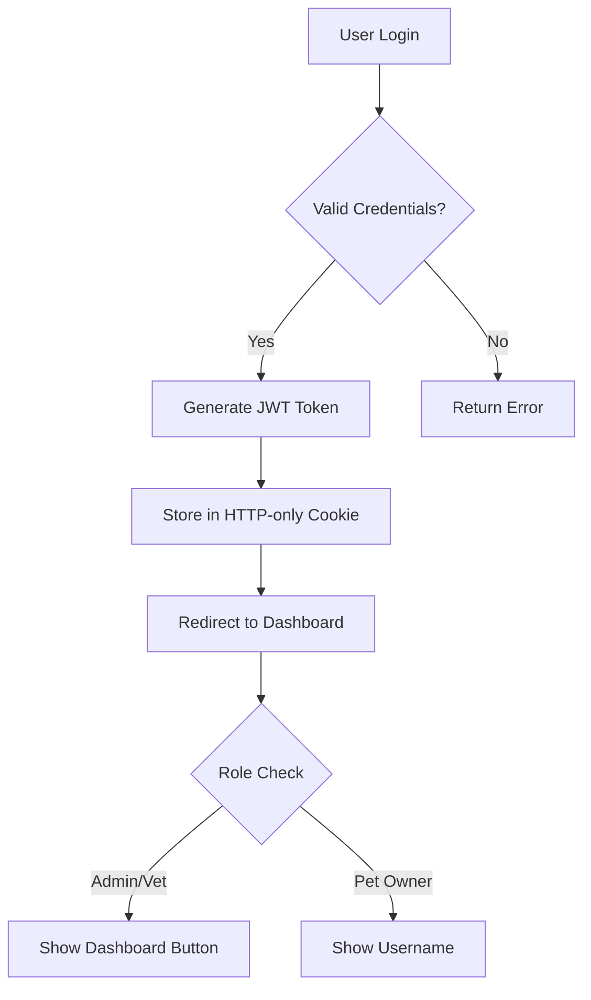

# Vet-Assistant (Vet🐾Care)

Vet-Assistant is a comprehensive veterinary practice management and pet care application designed to bridge the gap between pet owners and veterinarians. It features appointment booking, medical record management, AI-powered assistance, and role-based dashboards for Admins, Veterinarians, and Pet Owners.

[](https://nextjs.org/)
[](https://www.typescriptlang.org/)
[](https://www.mongodb.com/atlas)
[](https://tailwindcss.com/)
[](https://opensource.org/licenses/MIT)
=======
## 🚀 Tech Stack

- **Framework:** [Next.js 15](https://nextjs.org/) (App Router)
- **Language:** [TypeScript](https://www.typescriptlang.org/)
- **Styling:** [Tailwind CSS v4](https://tailwindcss.com/), [Framer Motion](https://www.framer.com/motion/), [Lucide React](https://lucide.dev/)
- **Database:** [MongoDB](https://www.mongodb.com/) (via Mongoose)
- **Caching:** [Redis](https://redis.io/)
- **Authentication:** JWT (JSON Web Tokens) with `jose` & `bcryptjs`
- **AI Integration:** [LangChain](https://js.langchain.com/), [Groq](https://groq.com/) (Llama-3 model), Google Generative AI
- **Utilities:** Axios, Nodemailer, JSPDF, React Hook Form

## 🏗️ Architecture & Design

### 🤖 AI-Powered Assistance (RAG & LLM)
The "Ask Vet Assist" feature leverages a sophisticated RAG (Retrieval-Augmented Generation) pipeline:
- **Context Awareness:** Chat history is cached in **Redis** (TTL 7 days) to maintain conversation context.
- **External Knowledge:** Uses **Tavily API** to fetch real-time veterinary research and news for queries about recent events (2024+).
- **LLM Engine:** Powered by **Groq (Llama-3-70b)** for high-speed inference.
- **Guardrails:** Strict prompt engineering ensures the AI only answers veterinary-related queries, rejecting irrelevant topics.

### 📅 Appointment System
A robust scheduling system built on MongoDB:
- **Status Workflow:** `scheduled` → `confirmed` → `completed` (or `cancelled`/`rescheduled`).
- **Data Integrity:** Mongoose schemas enforce referential integrity between `Appointments`, `Patients`, and `Veterinarians`.
- **Concurrency:** Optimistic locking prevents double-booking slots.

### 🔐 Security & Access Control
- **Edge Middleware:** `middleware.ts` intercepts requests to validate JWTs using `jose` (Edge-compatible).
- **RBAC:**
  - `/admin/*`: Restricted to users with `role: 'admin'`.
  - `/veterinarian/*`: Restricted to users with `role: 'vet'`.
  - `/tenant/*`: Implements strict tenant isolation logic.
- **Data Protection:** Passwords hashed with `bcryptjs`; sensitive routes protected against unauthorized access.

### 📄 Medical Reports & File Handling
- **Storage:** Secure local file storage (can be extended to S3/Cloudinary).
- **Validation:** Strict MIME-type checking (PDF, DICOM, Images) and size limits (5MB) on the server side.
- **Metadata:** File metadata linked to Patient and Appointment records in MongoDB for easy retrieval.

## ✨ Key Features

### 🐾 Pet Owner Features
- **Appointment Booking:** Schedule visits with available veterinarians.
- **Ask Vet Assist:** AI-powered chatbot for preliminary pet health queries.
- **Medical Reports:** View and download pet medical history (PDF support).
- **Service Discovery:** Browse available veterinary services.

### 🩺 Veterinarian Features
- **Dashboard:** Overview of appointments and patient stats.
- **Patient Management:** View and update medical records.
- **Profile Management:** Update availability and professional details.

### 🛠 Admin Features
- **User & Vet Management:** Oversee all platform users.
- **System Monitoring:** View logs and system health.
- **Content Management:** Manage FAQs and service listings.

## 📂 Project Structure

```bash
src/
├── app/                # Next.js App Router pages & API routes
│   ├── api/            # Backend API endpoints (AskVetcare, Reports, etc.)
│   ├── admin/          # Admin dashboard routes
│   ├── veterinarian/   # Veterinarian dashboard routes
│   └── ...             # Public routes (Home, About, Services)
├── components/         # Reusable UI components
│   ├── Ask-vet-Assit/  # AI Chatbot components
│   ├── Admin/          # Admin-specific components
│   └── ...
├── lib/                # Utilities & Configurations
│   ├── mongoDb.ts      # Database connection
│   ├── redisconfig.ts  # Redis client setup
│   ├── llmModel.ts     # AI Model configuration
│   └── nodeMailer.ts   # Email transporter
├── models/             # Mongoose Data Models (User, Appointment, MedicalReport)
└── middleware.ts       # Edge middleware for route protection
```

## 🛠️ Getting Started

### Prerequisites
- Node.js (v18+)
- MongoDB Instance
- Redis Instance (Optional, for caching)

### Installation

1. **Clone the repository**:
```bash
git clone https://github.com/jhaalok1997/vetCare.git
cd vetCare
```

2. **Install dependencies**:
```bash
npm install
# or
yarn install
```

3. **Set up environment variables**:
```env
# Database
MONGODB_URI=your_mongodb_connection_string

# Authentication
JWT_SECRET=your_jwt_secret

# AI Services
GROQ_API_KEY=your_groq_api_key
TAVILY_API_KEY=your_tavily_api_key
ENABLE_TAVILY=true

# Email Service
EMAIL_HOST=smtp.gmail.com
EMAIL_PORT=587
EMAIL_USER=your_email@gmail.com
EMAIL_PASS=your_app_password

# Application
NEXT_PUBLIC_APP_URL=http://localhost:3000
```

4. **Run the development server**:
```bash
npm run dev
# or
yarn dev
```

5. **Open your browser**:
Navigate to [http://localhost:3000](http://localhost:3000)

---

## 🏗 Architecture

### System Architecture
```
┌─────────────────┐    ┌─────────────────┐    ┌─────────────────┐
│   Frontend      │    │   Backend       │    │   External      │
│   (Next.js)     │◄──►│   (API Routes)  │◄──►│   Services      │
│                 │    │                 │    │                 │
│ • React         │    │ • JWT Auth      │    │ • Groq AI       │
│ • TypeScript    │    │ • MongoDB       │    │ • Tavily Search │
│ • Tailwind CSS  │    │ • NodeMailer    │    │ • Email Service │
│ • shadcn/ui     │    │ • Validation    │    │                 │
└─────────────────┘    └─────────────────┘    └─────────────────┘
```

### Database Schema
```typescript
// User Model
interface User {
  _id: ObjectId;
  username: string;
  email: string;
  password: string;
  role: 'petOwner' | 'vet' | 'admin';
  tenantId: string;
  resetToken?: string;
  resetTokenExpiry?: Date;
  createdAt: Date;
  updatedAt: Date;
}

// ContactedUser Model
interface ContactedUser {
  _id: ObjectId;
  name: string;
  email: string;
  message: string;
  phone?: string;
  createdAt: Date;
}

// DiagnosisReport Model
interface DiagnosisReport {
  _id: ObjectId;
  animalType: string;
  petAge: number;
  symptoms: string;
  urgency: 'low' | 'medium' | 'high';
  additionalNotes?: string;
  report: string;
  createdAt: Date;
}

// PatientOwner Model
interface PatientOwner {
  _id: ObjectId;
  ownerEmail: string;
  ownerPhone: string;
  countryCode: string;
  preferredContactMethod: 'phone' | 'email' | 'both';
  createdAt: Date;
}

// AnimalCategory Model
interface AnimalCategory {
  _id: ObjectId;
  petName: string;
  animalType: string;
  petAge: number;
  petBreed?: string;
  createdAt: Date;
}

// DiseasesCategory Model
interface DiseasesCategory {
  _id: ObjectId;
  DiseaseType: string;
  UrgencyLevel: string;
  Duration: number;
  Symptoms: string[];
  AdditionalInfo: string;
  createdAt: Date;
}
```

### API Routes Structure
```
/api/
├── Auth/
│   ├── login/route.ts
│   ├── signup/route.ts
│   ├── logout/route.ts
│   ├── profile/route.ts
│   ├── forgot-password/route.ts
│   └── reset-password/route.ts
├── AskVetcare-button/route.ts
├── ContactedUser/route.ts
├── faqs/route.ts
├── FormPateintDiagnose/route.ts
└── ServicesAPi/
    ├── animalCreated/route.ts
    ├── diseasesCreated/route.ts
    ├── patientOwner/route.ts
    ├── VetMatchLog/route.ts
    └── VetProfile/route.ts
```

---

## 🔐 Authentication & Authorization

### User Roles
- **Pet Owner**: Basic access to services and AI assistant
- **Veterinarian**: Professional tools and dashboard access
- **Admin**: Full system administration and user management

### Authentication Flow


### Security Features
- **Password Hashing**: bcrypt with salt rounds
- **JWT Tokens**: Secure token-based authentication
- **HTTP-only Cookies**: Prevents XSS attacks
- **Input Validation**: Comprehensive input sanitization
- **Rate Limiting**: API endpoint protection
- **CORS Protection**: Cross-origin security

---

## 🤖 AI Integration

### Groq Integration
```typescript
// Chat Assistant
const model = new ChatGroq({
  apiKey: process.env.GROQ_API_KEY,
  model: "llama-3.3-70b-versatile",
  temperature: 1,
});

// Diagnosis Engine
const model = new ChatGroq({
  apiKey: process.env.GROQ_API_KEY,
  model: "llama-3.3-70b-versatile",
  temperature: 1,
});
```

### Tavily Search Integration
```typescript
const tavilyClient = tavily({ 
  apiKey: process.env.TAVILY_API_KEY 
});

const searchOptions = {
  search_depth: "advanced",
  include_domains: [
    "avma.org",
    "vin.com", 
    "merckvetmanual.com",
    "vetmed.illinois.edu"
  ]
};
```

### AI Processing Pipeline

#### Chat Assistant Flow
1. **Query Validation**: Check if query is veterinary-related
2. **Current Information Detection**: Identify if query needs recent data
3. **Tavily Search**: Search for recent veterinary information
4. **Groq Processing**: Generate AI response using LLM
5. **Response Formatting**: Format response with markdown
6. **History Management**: Store conversation history in Redis

#### Diagnosis Report Flow
1. **Form Submission**: User submits pet health assessment form
2. **Data Collection**: Collect owner, pet, and disease information
3. **Save to MongoDB**: Store patient owner, animal, and disease data
4. **AI Analysis**: Groq AI analyzes symptoms and pet information
5. **Report Generation**: Generate structured diagnosis report
   - Possible diseases (max 3)
   - Disease descriptions
   - Home care advice
   - Urgent care recommendations
6. **Save Diagnosis**: Store diagnosis report in MongoDB
7. **PDF Export**: User can download report as PDF

---

## 📱 User Interface

### Component Library
- **shadcn/ui**: Modern, accessible components
- **Custom Components**: Specialized veterinary components
- **Responsive Design**: Mobile-first approach
- **Dark Mode**: Theme switching capability

### Key Components
- **Navbar**: Role-based navigation with user info
- **AuthWrapper**: Authentication state management
- **VetAssistant**: AI chat interface
- **ServiceCards**: Service display components
- **ContactForm**: User inquiry form

### Design System
- **Color Palette**: Veterinary-themed color scheme
- **Typography**: Clear, readable fonts
- **Spacing**: Consistent spacing system
- **Icons**: Lucide React icon library

---

## 🔧 Environment Setup

### Required Environment Variables

| Variable | Description | Required | Default |
|----------|-------------|----------|---------|
| `MONGODB_URI` | MongoDB connection string | ✅ | - |
| `JWT_SECRET` | Secret for JWT tokens | ✅ | - |
| `GROQ_API_KEY` | Groq API key | ✅ | - |
| `TAVILY_API_KEY` | Tavily API key | ✅ | - |
| `ENABLE_TAVILY` | Enable Tavily integration | ✅ | `true` |
| `EMAIL_HOST` | SMTP host for emails | ✅ | - |
| `EMAIL_PORT` | SMTP port | ✅ | `587` |
| `EMAIL_USER` | Email username | ✅ | - |
| `EMAIL_PASS` | Email password | ✅ | - |
| `NEXT_PUBLIC_APP_URL` | Application URL | ❌ | `http://localhost:3000` |

### Development Setup
```bash
# Install dependencies
npm install

# Set up environment variables
cp .env.example .env.local

# Run development server
npm run dev

# Run linting
npm run lint

# Run type checking
npm run type-check
```

---

## 📊 API Documentation

### Authentication Endpoints

#### POST `/api/Auth/signup`
Register a new user account.

**Request Body:**
```json
{
  "username": "string",
  "email": "string",
  "password": "string",
  "role": "petOwner" | "vet" | "admin"
}
```

**Response:**
```json
{
  "success": true,
  "message": "User created successfully",
  "user": {
    "id": "string",
    "username": "string",
    "email": "string",
    "role": "string"
  }
}
```

#### POST `/api/Auth/login`
Authenticate user and return JWT token.

**Request Body:**
```json
{
  "email": "string",
  "password": "string"
}
```

**Response:**
```json
{
  "success": true,
  "message": "Login successful",
  "user": {
    "id": "string",
    "username": "string",
    "email": "string",
    "role": "string"
  }
}
```

### AI Assistant Endpoints

#### POST `/api/AskVetcare-button`
Get AI-powered veterinary assistance with conversation history.

**Request Body:**
```json
{
  "question": "string",
  "userId": "string"
}
```

**Response:**
```json
{
  "answer": "string",
  "history": [
    {
      "role": "user" | "assistant",
      "content": "string"
    }
  ]
}
```

#### POST `/api/FormPateintDiagnose`
Generate AI-powered diagnosis report for pet health assessment.

**Request Body:**
```json
{
  "ownerEmail": "string",
  "ownerPhone": "string",
  "countryCode": "string",
  "preferredContactMethod": "phone" | "email" | "both",
  "petName": "string",
  "animalType": "string",
  "diseaseCategory": "string",
  "petAge": "number",
  "petBreed": "string (optional)",
  "duration": "number (days)",
  "symptoms": "string",
  "urgency": "low" | "medium" | "high",
  "additionalNotes": "string (optional)"
}
```

**Response:**
```json
{
  "report": "string (formatted diagnosis report)"
}
```

**Features:**
- Analyzes pet symptoms using Groq AI (llama-3.3-70b-versatile)
- Provides possible diseases (max 3) with descriptions
- Suggests immediate home care advice
- Recommends when to seek urgent veterinary care
- Saves diagnosis to MongoDB for record keeping
- Generates downloadable PDF reports via frontend

---

## 📄 License

This project is licensed under the MIT License - see the [LICENSE](LICENSE) file for details.

---

## 👥 Authors

- **Alok Kumar Jha** - *Initial work & Lead Developer* - [@jhaalok1997](https://github.com/jhaalok1997)

---

## 🙏 Acknowledgments

- [shadcn/ui](https://ui.shadcn.com/) for the beautiful component library
- [Next.js](https://nextjs.org/) team for the amazing framework
- [MongoDB](https://www.mongodb.com/) team for the reliable database
- [Groq](https://groq.com/) for the AI processing capabilities
- [Tavily](https://tavily.com/) for the search functionality
- All contributors and supporters

---

## 📞 Support

- **Documentation**: [Wiki](https://github.com/jhaalok1997/vetCare/wiki)
- **Issues**: [GitHub Issues](https://github.com/jhaalok1997/vetCare/issues)
- **Discussions**: [GitHub Discussions](https://github.com/jhaalok1997/vetCare/discussions)
- **Email**: support@vetcare.com

---

<div align="center">

**Made with ❤️ by [Alok Kumar Jha](https://github.com/jhaalok1997)**

[⬆ Back to Top](#-vetcare-assistant)
